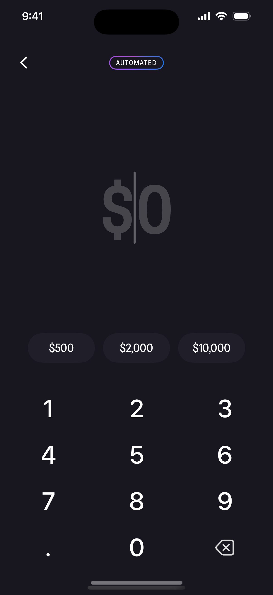
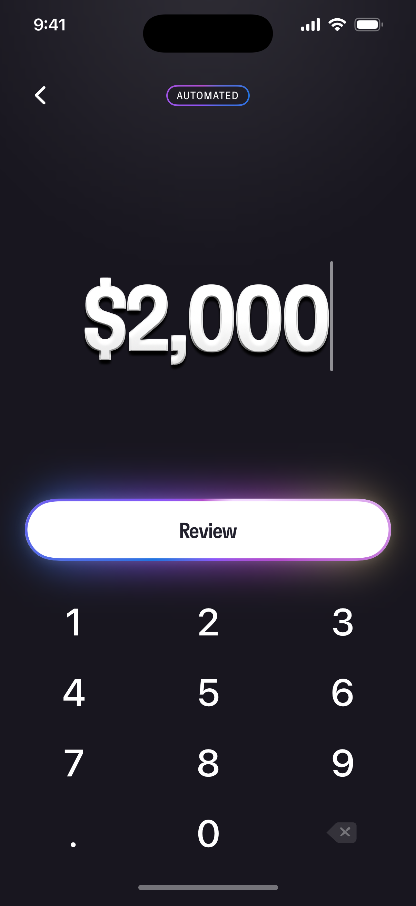
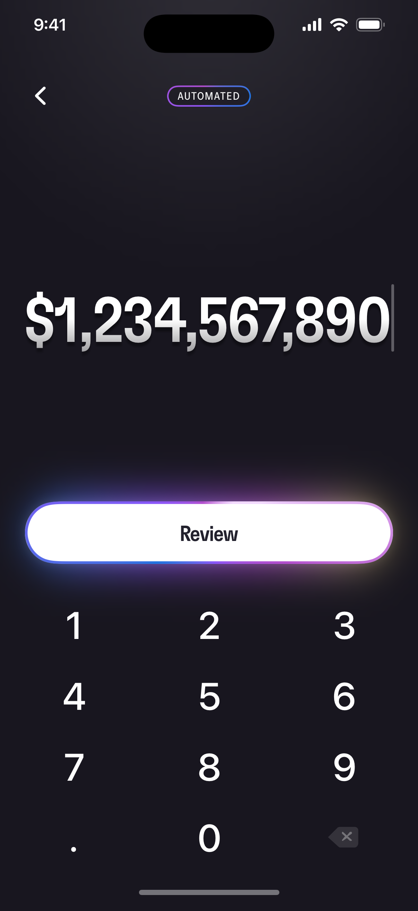
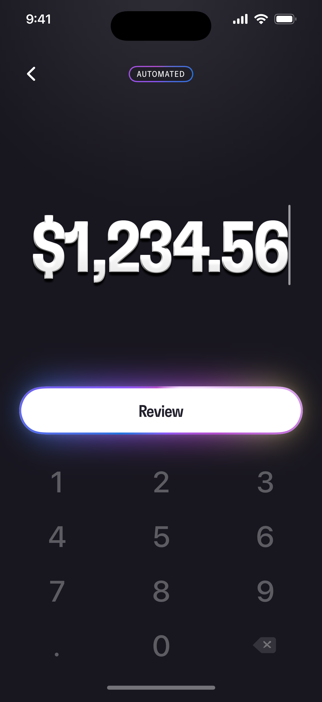

# Alinea — Amount Entry Screen

A pixel-faithful SwiftUI implementation of the "amount entry" screen from the
Alinea frontend take-home Figma file. The number pad is fully functional and
drives a live, formatted amount; the screen reproduces the two sample states
(empty and entered) and follows every annotation left in the design.

| Empty state | Entered state | Auto-scaling | Decimal |
|:---:|:---:|:---:|:---:|
|  |  |  |  |

🎬 **Demo clip:** [`screenshots/demo.mp4`](screenshots/demo.mp4) — an interactive
walkthrough: the empty screen, tapping a suggestion chip (chips animate out, the
Review button animates in), backspacing back to empty, then typing a grouped
decimal amount. Along the way it shows the animated Review border (a brand
gradient with a bright highlight sweeping around it), the breathing glow and the
blinking caret. The four stills above show the keypad results.

---

## Requirements

- **Xcode 16+** — built in **Swift 6 language mode** (complete strict concurrency)
- **iOS 17+** deployment target (uses the `@Observable` macro)
- XcodeGen (`brew install xcodegen`) — only needed if you want to regenerate the
  project from `project.yml`

## Getting started

The generated `AlineaAmountEntry.xcodeproj` is committed, so you can clone and run
immediately:

```bash
open AlineaAmountEntry.xcodeproj   # ⌘R on an iPhone simulator
```

Or from the command line:

```bash
xcodebuild -scheme AlineaAmountEntry \
  -destination 'generic/platform=iOS Simulator' build
```

To regenerate the project after editing `project.yml`:

```bash
xcodegen generate
```

## Running the tests

```bash
# substitute any installed iOS 17+ simulator (or just press ⌘U in Xcode)
xcodebuild test -scheme AlineaAmountEntry \
  -destination 'platform=iOS Simulator,name=iPhone 16'
```

- **`AlineaAmountEntryTests`** — 28 unit tests covering every keypad rule
  (grouping, leading zeros, decimal limits, zero-vs-empty, backspace, suggestions,
  input sanitization and suggestion clamping).
- **`AlineaAmountEntryUITests`** — 7 end-to-end tests that tap the on-screen
  keypad and assert the displayed amount, proving the pad is "fully functional"
  (including the launch-prefill hook and the large-value path).

## How the design comments were addressed

The Figma file asked to "pay attention to the comments". Each one is implemented:

| # | Comment | Implementation |
|---|---------|----------------|
| 1 | *Suggestion bubbles should only appear when the user has nothing entered* | Chips are shown only while `isEmpty` (`$0`); any entry swaps them for **Review**. |
| 2 | *The border gradient should animate in some way* | The Review button's border is an `AngularGradient` whose angle rotates continuously. |
| 3 | *Animate the transition from the bubbles to the buttons* | Chips ↔ Review cross-fade with a spring scale transition. |
| 4 | *Keypad buttons should have haptics* | Every key fires a light `UIImpactFeedbackGenerator`. |
| 5 | *The caret should blink and always be at the end of the entered amount* | A blinking caret is rendered at the trailing edge of the value (and after `$` when empty). |
| 6 | *Decimal button should be disabled when inappropriate* | The `.` key is disabled once a decimal point exists; fractions are capped at 2 digits. |
| 7 | *Text should scale to fit the screen when it's too large* | The amount measures itself and shrinks the font to fit the width. |

The back button and Review button are intentionally non-functional, as the brief
specified.

## Architecture

A small **MVVM** structure keeps all input logic testable and separate from the views.

```
AlineaAmountEntry/
├── App/                         # @main entry, Info.plist (fonts, status bar)
├── Sources/
│   ├── Theme/
│   │   ├── Theme.swift          # colors, fonts & brand gradients (Figma variables)
│   │   └── Metrics.swift        # layout + motion design tokens (no magic numbers)
│   ├── Utilities/
│   │   ├── AmountFormatter.swift # "$1,234.56" formatting (locale-independent)
│   │   ├── A11y.swift            # accessibility-id namespace (shared with UI tests)
│   │   └── Haptics.swift
│   ├── ViewModels/
│   │   └── AmountEntryViewModel.swift   # all keypad rules — fully unit-tested
│   └── Views/
│       ├── AmountEntryView.swift        # screen assembly
│       └── Components/                   # StatusBar, AutomatedBadge, BackButton,
│                                         # AmountDisplay (+caret), QuickAmountChips,
│                                         # Keypad, ReviewButton, PressableStyle,
│                                         # TopGlow, HomeIndicator
├── Resources/
│   ├── Fonts/                   # GT Flexa Cn Md, Instrument Sans SemiCondensed
│   └── Assets.xcassets
AlineaAmountEntryTests/          # unit tests
AlineaAmountEntryUITests/        # UI tests + demo recording
```

### Design fidelity notes

- Colors, spacing, radii and typography were pulled directly from the Figma file
  (`#18161F` background, `#B24DCC → #8955F9` brand gradient, GT Flexa Condensed
  Medium for the amount, Instrument Sans SemiCondensed for the chips, SF Pro for
  the keypad — exactly as in the design).
- The two custom fonts are bundled and registered via `UIAppFonts`.
- Grouping (`,`) and decimal (`.`) separators are fixed to the design's US style so
  the result is identical regardless of device locale.

### Testing/preview hook

In **DEBUG** builds only, two environment-variable hooks make the screen
scriptable, and both are compiled out of release builds:

- `AMOUNT_PREFILL` seeds the entered amount on launch (e.g. `AMOUNT_PREFILL=2000`).
  It is used by the UI tests and by `scripts/snapshot.sh` to capture the README
  screenshots.
- `DEMO_AUTOPLAY=1` plays the scripted walkthrough used to record `demo.mp4`
  (empty → suggestion chip → clear → type a decimal amount). It drives the view
  model on a timer so the clip can be recorded directly with `simctl` —
  unlike a UI test, it doesn't interrupt the screen recording.
